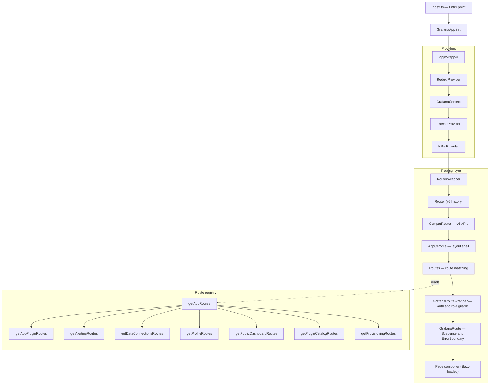

# React Router architecture

This document describes how Grafana's frontend routing works, from the application entry point down to individual route components.

## Overview

Grafana uses **React Router v5** with the **`react-router-dom-v5-compat`** package, which provides React Router v6-style APIs (`<Routes>`, `<Route>`, `useParams`, `useLocation`, `<Navigate>`) on top of the v5 runtime. Routes are defined as flat `RouteDescriptor[]` arrays, rendered through a guard layer (`GrafanaRouteWrapper`) and a lazy-loading layer (`GrafanaRoute`) before reaching the page component.

## Architecture diagram

The following diagram shows the component hierarchy from the application root to a rendered page:



## Key components

Each component in the routing pipeline has a specific responsibility.

### Entry point and bootstrap

- **`public/app/index.ts`:** Waits for `window.grafanaBootData`, then calls `GrafanaApp.init()`.
- **`AppWrapper`:** Class component that sets up all global providers (Redux, theme, context, command palette) and renders `RouterWrapper` once the app is ready.

### Routing layer

- **`RouterWrapper`** (`public/app/routes/RoutesWrapper.tsx`): Wraps the v5 `<Router>` with `locationService.getHistory()`, then layers `<CompatRouter>` for v6-style components, and nests `<AppChrome>` for the layout shell.
- **`AppChrome`:** Renders the MegaMenu, top navigation bar, and extension sidebar. Routes with `chromeless: true` skip this shell.
- **`<Routes>`:** Rendered inside `AppWrapper.renderRoutes()` by mapping each `RouteDescriptor` to a `<Route>` element.

### Route guards

`GrafanaRouteWrapper` (`public/app/core/navigation/GrafanaRoute.tsx`) runs two checks before rendering:

- **Authentication:** If the route doesn't set `allowAnonymous` and anonymous access isn't enabled, unauthenticated users are redirected to `/login`.
- **Role authorization:** If the route defines `roles()`, users without a matching role are redirected to `/`.

### Lazy loading and error handling

`GrafanaRoute` wraps each page component in:

- **`<Suspense>`** with a `<GrafanaRouteLoading />` fallback for code-split chunks.
- **`<ErrorBoundary>`** that catches render errors and shows `<GrafanaRouteError />`.

Page components are wrapped with `SafeDynamicImport`, which uses `React.lazy()` with named webpack chunks.

## Route definitions

All routes are defined as `RouteDescriptor` objects in `public/app/routes/routes.tsx` through the `getAppRoutes()` function. The `RouteDescriptor` interface defines each route:

```typescript
interface RouteDescriptor {
  path: string;
  component: GrafanaRouteComponent;
  roles?: () => string[];
  pageClass?: string;
  routeName?: string;
  chromeless?: boolean;
  sensitive?: boolean;
  allowAnonymous?: boolean | ((params) => boolean);
}
```

Replace the following placeholders:

- **`path`:** The URL pattern, for example `/d/:uid/:slug?`.
- **`component`:** The lazy-loaded page component.
- **`roles`:** An optional function that returns required roles.
- **`chromeless`:** When `true`, the route renders without the AppChrome layout.
- **`allowAnonymous`:** Permits unauthenticated access.

### Feature-specific route modules

`getAppRoutes()` merges routes from several feature modules:

| Module | File | Purpose |
|--------|------|---------|
| Plugin routes | `public/app/features/plugins/routes.tsx` | App plugin pages (registered first to allow overrides) |
| Alerting | `public/app/features/alerting/routes.tsx` | Alert rules, silences, contact points |
| Connections | `public/app/features/connections/routes.tsx` | Data source connections |
| Profile | `public/app/features/profile/routes.tsx` | User profile and preferences |
| Public dashboards | `public/app/features/dashboard/routes.ts` | Publicly shared dashboards |
| Plugin catalog | `public/app/features/plugins/admin/routes.tsx` | Plugin installation and management |
| Provisioning | `public/app/features/provisioning/utils/routes.ts` | Provisioning configuration |

## Conditional routing

Some routes are gated by feature toggles or configuration flags. For example:

- Dashboard routes check `config.featureToggles.suggestedDashboards`.
- Public dashboard routes check `config.publicDashboardsEnabled`.
- Alerting routes check `config.unifiedAlertingEnabled`.

Plugin routes are registered first in the route array so they can override core routes through React Router's `<Switch>` evaluation order.

## Data loading

Grafana doesn't use React Router loaders or actions. All data fetching happens inside page components, typically through Redux, React Query, or direct API calls.

## Related resources

- [React Router v5 documentation](https://v5.reactrouter.com/)
- [react-router-dom-v5-compat](https://github.com/remix-run/react-router/tree/main/packages/react-router-dom-v5-compat)
